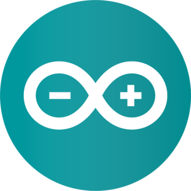

<!-- Banner -->

  

 

<!-- Github Status -->
<h2>
  My GitHub Stats
  
</h2>
  

  

  

<!-- Contact With Me -->
<h2>
  Connect With Me 
  
</h2> 

  <!-- Dev-Communitys-->
    
  <!-- Twitter -->
  
  <!-- Linkedin -->
  
  <!-- Stack-Overflow -->
  
  <!-- Facebook -->
  
  <!-- Instagram -->
  
  <!-- Dribble -->
  
  <!-- Behance -->
  
  <!-- Medium -->
  
  <!-- Youtube -->
  

 

<!-- Language and Tools -->
<h2>🛠️Languages and Tools
  
</h2> 

  <!-- MongoDB -->
  
  <!-- Express -->
  
  <!-- React -->
  
  <!-- Node -->
  
  <!-- Next_js -->
  
  <!-- Java-Script -->
  
  <!-- Firebase -->
  

 

  <!-- HTML -->
  
  <!-- CSS -->
  
  <!-- Tailwind -->
  
  <!-- Bootstrap -->
  
  <!-- Figma -->
  
  <!-- git -->
  

 

  <!-- Python -->
  
  <!-- Selenium -->
  
  <!-- C -->
  
  <!-- C++ -->
  
  <!-- C# -->
  
  <!-- arduino -->
  

 

<!-- About Me -->
<h1>About Me :
  
</h1> 

I am a Front-End Developer (react) from Bangladesh. 

- 🚀 My passion as a React Front-End Developer extends beyond crafting elegant code — I find true fulfillment in building websites that transcend digital boundaries to solve real-life problems. Each line of code I write is a step towards creating impactful solutions that address tangible challenges.

- 💡 I view websites as more than just online spaces—they're dynamic tools that can truly impact lives. I work to make every website user-friendly and seamlessly functional, turning each one into a powerful solution for real-world challenges. Let's craft websites that make a difference, together! 🌟

- 🌍 In web development, I make things work better, smoother, and bring people closer. My goal is to contribute positively by boosting efficiency and connectivity. I'm committed to turning innovative ideas into practical solutions that solve real problems. Let's build a better world together!

- 🌟 If you're in search of a React Front-End Developer who combines a formal approach with a dedication to building websites that truly matter, I invite you to connect. Reach out to me at mahfujurrahman06627@gmail.com, and let's collaborate to bring your digital vision to life.🚀

 
<!-- Support Me -->
<h2>
  Support Me 
  
</h2> 

  

  
<!-- Waves -->

<!-- ### ✍️ Blog Posts : -->

<!-- BLOG-POST-LIST:START -->
<!-- BLOG-POST-LIST:END -->
