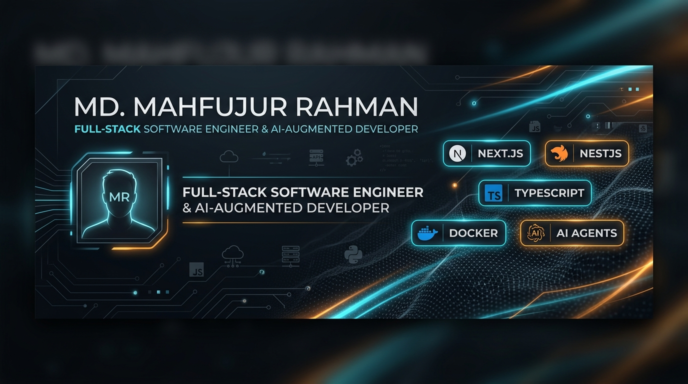

<!-- Banner -->

  

 

  <!-- Typewriter / Subtitle Tagline -->
  

  <!-- Social & Direct Badges -->
  

    
    
    
    
    
  

---

### 👨‍💻 Architecture & Systems Profile

I am a **Full-Stack Software Engineer & Systems Architect** based in Dhaka, focused on designing high-availability web platforms, cross-platform client applications, and resilient cloud architectures. I operate with **extreme technical ownership**—bridging the gap between low-level system performance, clean architectural boundaries, and strategic business velocity.

I believe in **radical technical adaptability**: no platform boundary or engineering blocker is off-limits. Whether architecting distributed microservices, building cross-platform desktop runtimes (**Tauri**) and mobile apps (**React Native / Flutter**), configuring load-balanced **Linux** clusters, or engineering custom **WordPress plugins** and Gutenberg blocks from scratch—I take complete responsibility from initial problem analysis to zero-downtime production deployment.

- 🔭 **Architectural Focus:** Distributed microservices, enterprise backends (**NestJS**, **Node.js**, **Django**), modern client platforms (**Next.js**, **Tauri**, **React Native**), and high-availability Linux infrastructure.
- ⚙️ **Infrastructure & Scalability:** Traffic management, reverse proxies & **load balancing (Nginx)**, container orchestration (**Docker**, **Kubernetes**), and cloud provisioning (**AWS**, **DigitalOcean**).
- 💡 **Senior Mindset:** Systems must be self-healing, automated, maintainable, and cost-efficient. Code is not just written to function—it is structured to scale and outlive team transitions.
- 💳 **Payment & Monetization Architecture:** Production-ready billing engines across global fiat & cryptocurrency gateways (**Stripe**, **NOWPayments**, **Plisio**, **SSLCommerz**, and multi-chain crypto settlement: BTC, ETH, USDT, SOL).
- 🤖 **AI-Augmented Velocity:** Utilizing agentic orchestration (**MCP**, **LangChain**, **n8n**) and semantic RAG systems to supercharge execution and eliminate operational friction.

---

### 💼 Professional Experience

- **Full Stack Developer** — **Betopia Group** `(Oct 2025 – Present)`
  - Leading backend architecture and microservice modularization using NestJS, Prisma, and PostgreSQL.
  - Designing fault-tolerant database schemas, high-throughput REST APIs, and automated deployment flows across AWS (EC2) and DigitalOcean.
- **Next.js Developer** — **NEXSTACK** `(Sep 2024 – Sep 2025)`
  - Architected enterprise-grade, SEO-optimized web applications utilizing Next.js App Router and TypeScript.
  - Engineered seamless state hydration, caching strategies, and robust client-side architecture.
- **Junior Web Developer** — **Lyricz Software** `(Aug 2023 – Aug 2024)`
  - Built full-stack features, designed core relational schemas, and delivered responsive design systems across all device viewports.

---

### 🛠️ Technical Stack & Architecture Toolbox

| Domain | Technologies & Systems |
| :--- | :--- |
| **Backend & Microservices** | `NestJS` `Node.js` `Express.js` `FastAPI` `Django` `GraphQL` `REST APIs` `Prisma ORM` |
| **Frontend & Web Platforms** | `Next.js (App Router)` `React.js` `Vue.js` `TypeScript` `Tailwind CSS` `ShadCN UI` `Zustand` |
| **Cross-Platform (Desktop & Mobile)** | `Tauri (Rust + Web Desktop)` `React Native` `Flutter` |
| **DevOps, Infra & Cloud** | `Linux` `Nginx (Reverse Proxy & Load Balancing)` `Docker` `Kubernetes (K8s)` `AWS (EC2)` `DigitalOcean` `GitHub Actions (CI/CD)` |
| **Databases & Distributed Storage** | `PostgreSQL` `pgvector` `TimescaleDB` `MongoDB` `MySQL` `Redis` `MinIO` |
| **CMS & Plugin Engineering** | `WordPress (Custom Plugins & Themes)` `Gutenberg Blocks (block.json)` `PHP` `Headless CMS` |
| **AI, RAG & Automation** | `LangChain` `Semantic RAG` `Vector Databases` `n8n` `Autonomous AI Agents` `Model Context Protocol (MCP)` `Ollama` |
| **Payments, Crypto & Billing** | `Stripe` `NOWPayments` `Plisio` `Crypto Payment Gateways (BTC, ETH, USDT, SOL)` `SSLCommerz` `Webhooks` `OAuth 2.0` `Event-Driven Billing` |

 

  <!-- Skill Badges -->
  
  
  
  
  
  
  
  
  
  
  
  
  
  
  
  
  

---

### 📐 Senior Engineering & Architectural Principles

1. **Radical Technical Adaptability & Problem Resolution:**  
   No platform bottleneck is insurmountable. If an application demands low-resource desktop performance, I compile with **Tauri**; if mobile users need native experiences, I build with **React Native / Flutter**; if custom CMS workflows require bespoke logic, I engineer custom **WordPress plugins** and Gutenberg blocks from first principles.
2. **High Availability & Fault Tolerance:**  
   Architecting for zero single-points-of-failure. Enforcing active **load balancing**, reverse proxy routing with **Nginx**, horizontal container autoscaling with **Docker & Kubernetes**, resilient database connection pooling, and distributed caching with Redis.
3. **Domain Modularity & Separation of Concerns:**  
   Strict isolation between business domain logic, presentation layers, and infrastructure adapters. Codebases remain testable, refactorable, and clean across long-term product lifecycles.
4. **Automated & AI-Augmented Pipelines:**  
   Integrating intelligent workflow automation (agentic orchestration, semantic search/RAG, and n8n pipelines) to turn complex manual overhead into streamlined, self-managing software.

---

### 🎓 Education & Achievements

- 🏛️ **Diploma in Computer Technology** – Kushtia Polytechnic Institute *(Graduated 2025 | CGPA: 3.48)*
- 🤖 **Institute Level Skills Competition (2023)** – Led the design & implementation of an autonomous voice-controlled robotics project.
- 💡 **Complete Web Development (AI-First Approach)** – Programming Hero

---

### 📊 GitHub Activity & Metrics

  

 

  

---

### 🌐 Connect & Collaborate

   &nbsp;&nbsp;
   &nbsp;&nbsp;
   &nbsp;&nbsp;
   &nbsp;&nbsp;
   &nbsp;&nbsp;
   &nbsp;&nbsp;
   &nbsp;&nbsp;
  

  

  

